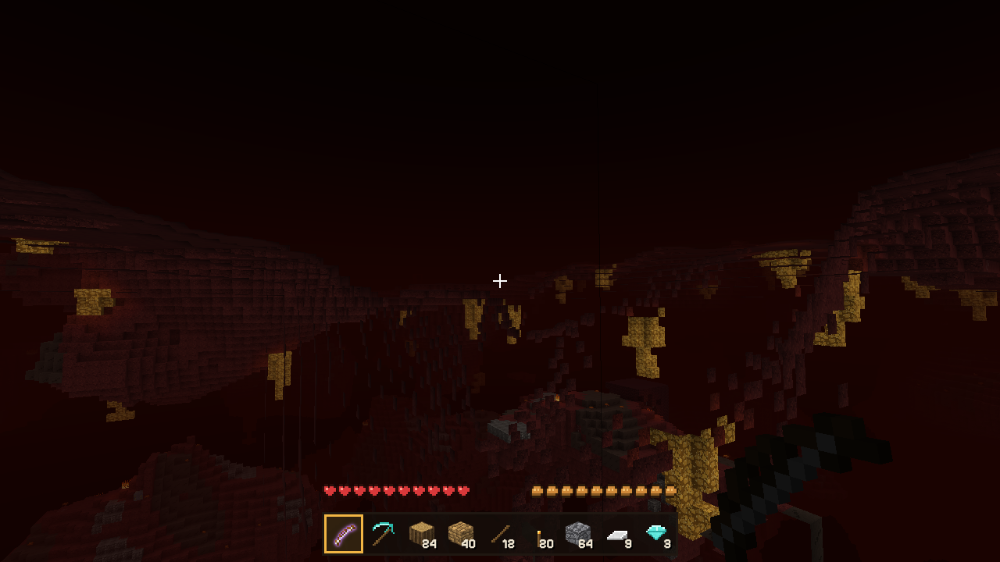
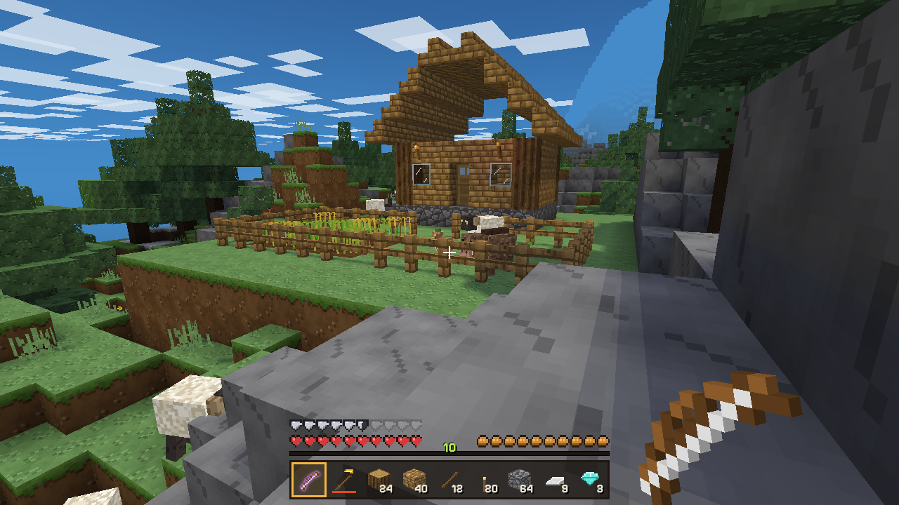
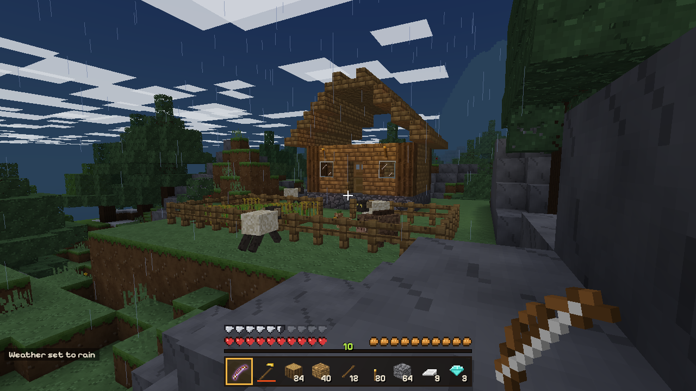
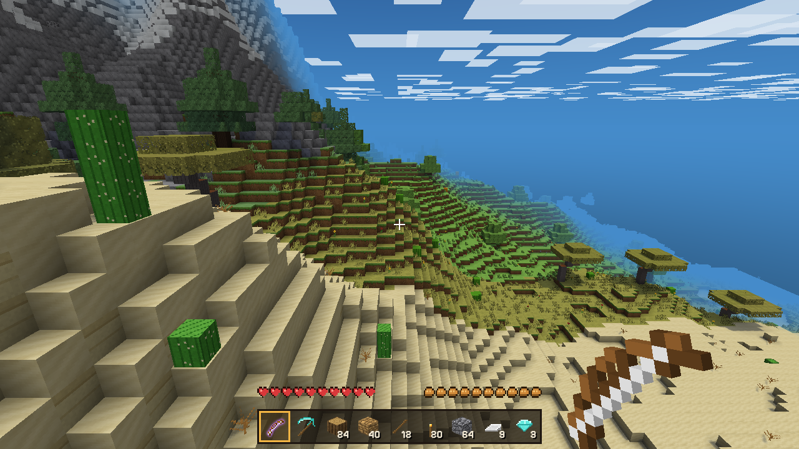

# Blockhaven

A blocky survival sandbox that runs in your browser. Dig into an endless world, craft tools, build a home, farm, fish, enchant your gear, and make it through the night.


Blockhaven plays like the classic block-building survival games: the same block size, movement physics, crafting grid, mining times, hunger and day/night rhythm. Every texture, sound, creature and line of code is original to this project. There are no image or audio files at all: textures are painted procedurally at startup and sounds are synthesized with the Web Audio API.

Blockhaven is an independent fan project. It is not affiliated with or endorsed by Mojang Studios or Microsoft, and it contains none of their assets.

## Play

**In your browser:** once GitHub Pages has deployed, the game is at <https://krabduke.github.io/blockhaven/>.

**Locally:**

```bash
git clone https://github.com/krabduke/blockhaven.git
cd blockhaven
npm install
npm run dev
```

Then open the address Vite prints (usually <http://localhost:5173>). You need a browser with WebGL2: any recent Chrome, Edge, Firefox or Safari.

Worlds save automatically to your browser's storage (IndexedDB) every 30 seconds and when you quit to the title screen.

## Screenshots

| | |
|---|---|
|  |  |
|  |  |
|  |  |
|  |  |
|  |  |
|  |  |
|  |  |

## Features

**World**
- Endless, seeded terrain in 16×16×256 chunks, streamed around you by background workers
- Biomes: plains, forest, birch forest, snowy taiga, desert, savanna, swamp, beach, ocean and mountains, each with its own grass and foliage tint
- **Villages** of houses, farms, a smithy, a library, lamp posts and a well with a bell, joined by dirt paths. Villagers trade with you in amber, and a Stonewarden guards each village. Find the nearest one with `/locate village`
- **The Emberdeep**, a second dimension beneath the world: cinderstone caverns over a lava sea, glowstone hanging from the ceiling, ashsand that slows you down, magma rock, emberquartz, eternal fires and ruined cinder keeps with loot. Build a 4×5 obsidian frame, light it with flint and steel, and stand in the gate. Distances there are one-eighth of the overworld's
- Winding tunnel caves and large caverns, lava lakes deep down, and coal, iron, gold and diamond ore at their usual depths
- Oak, birch and spruce trees, cacti, sugar cane, flowers, tall grass and pumpkins
- Dungeons: mossy rooms with a monster cage that keeps spawning creatures, and chests of loot
- Day and night on a 20-minute cycle, with sun, moon, stars, drifting clouds, and rain, snow and thunderstorms

**Blocks and building**
- 115 blocks, including stairs, slabs, fences, fence gates, doors, trapdoors, ladders, glass and glass panes, iron bars, lanterns, signs you can write on, carpets, six colours of wool, slate, marble, terracotta, hay bales, cake, bookshelves, TNT and lamps
- Power: buttons, pressure plates and levers send power along spark dust wire to light lamps, open doors, trapdoors and gates, and set off TNT
- Fire that spreads through wood, wool and leaves and burns out on its own, and puts itself out in the rain
- Smooth lighting with ambient occlusion; sunlight and torchlight both flood-fill through the world
- Flowing water and lava (water plus lava makes obsidian or cobblestone), sand and gravel that fall, leaves that decay when their tree is cut down

**Survival**
- Health, hunger, saturation and air, with fall, drowning, lava, fire and starvation damage
- Mining times that depend on the tool, with wooden, stone, iron, golden and diamond pickaxes, axes, shovels, swords and hoes, and tool durability
- The crafting grid (2×2 in your inventory, 3×3 at a crafting table) with the standard recipes, including mirrored ones
- Furnaces that smelt ores, cook food and bake glass, with fuel burn times
- Chests, beds (sleep through the night and set your respawn point) and dropped-item pickup
- Armor in leather, gold, iron and diamond, with an armor bar and damage reduction
- Experience from mobs, ores, smelting, breeding and fishing, plus an enchanting table that uses it (Efficiency, Sharpness, Protection, Unbreaking, Power, Feather Falling). Bookshelves around the table unlock stronger enchantments
- Bows and arrows with a charge-up draw, snowballs, eggs and a fishing rod
- Farming: till with a hoe, then plant wheat and carrots, which grow in the light. Bone meal speeds up crops, saplings and grass
- Achievements for the classic milestones

**Graphics**
- Sun shadows from a shadow map, directional sunlight on every face, a gradient sky with a sun glow and a warm band at dawn and dusk, water that reflects the sky and catches the sun, flickering torchlight and filmic colour grading. Switch between Fancy and Fast in Settings
- Procedurally painted textures with bevelled stones, wood grain, bark ridges and layered foliage
- Blocks crack apart into shards as you mine them

**Creatures (all original designs)**
- **Boar**, **Hen** and **Woolback** (a curly-horned ram): follow you when you hold their food, can be bred into babies, and drop food, leather, feathers and wool. Shear a Woolback for its wool; it grows back as it grazes. Hens lay eggs
- **Mirewalker**: a mossy shambler that comes out at night and burns in sunlight
- **Shellcrawler**: a six-legged cave dweller, calm in daylight unless provoked
- **Brambler**: a thorn-covered creature that keeps its distance and shoots barbs at you
- **Burrowfox**, **Bogfrog** (swamps), **Streamfish** (water) and **cave moths**
- **Dune Scuttler**: a fast desert pest. **Frostling**: an icy imp in snowy places that throws snowballs
- **Villagers**: farmers, shepherds, fishers, butchers, clerics, smiths and librarians, each with their own trades. **Stonewarden**: a mossy guardian that fights monsters near its village
- **Emberwisp**: floats through the Emberdeep lobbing fireballs. **Cinderbrute**: a heavy basalt brute that shrugs off fire

**Game modes**
- Survival, and Creative (fly, instant breaking, and every block and item in a searchable palette)
- Title screen, world list, create world with a seed, pause menu, settings (render distance, field of view, mouse sensitivity, brightness, volume, view bobbing, invert mouse), death screen and a debug overlay

## Controls

| Key | Action |
|---|---|
| Mouse | Look around |
| W A S D | Move |
| Space | Jump (double-tap to fly in Creative) |
| Shift | Sneak (you won't walk off edges) |
| Ctrl, or double-tap W | Sprint |
| Left click | Mine or attack |
| Right click | Place, use, eat, open, draw a bow, cast a rod |
| Middle click | Pick the block you're looking at |
| 1–9 or scroll wheel | Choose a hotbar slot |
| E | Inventory |
| Q | Drop one item (Ctrl+Q drops the stack) |
| T or / | Commands |
| F3 | Debug info |
| F1 | Hide the HUD |
| Esc | Pause |

In inventories: click to pick up or place a stack, right-click to split or place one, shift-click to move a stack across, and press 1–9 while hovering a slot to swap it with the hotbar.

## Commands

`/gamemode survival|creative`, `/time set day|noon|sunset|night|midnight|<ticks>`, `/weather clear|rain|thunder`, `/give <item> [count]`, `/xp <amount>`, `/tp <x> <y> <z>`, `/spawn <mob>`, `/locate village`, `/dimension overworld|ember`, `/seed`, `/kill`, `/help`

Item names for `/give` are the lowercase names with underscores, for example `/give diamond_pickaxe` or `/give oak_stairs 64`.

## How it's built

TypeScript, [Vite](https://vite.dev) and [Three.js](https://threejs.org), with no game engine.

| Area | Where |
|---|---|
| Block and item registry | `src/blocks.ts`, `src/items.ts` |
| Terrain, caves, ores, trees, dungeons | `src/world/worldgen.ts` |
| Villages | `src/world/villages.ts` |
| The Emberdeep | `src/world/embergen.ts` |
| Trading | `src/trading.ts` |
| Chunk meshing (face culling, smooth light, ambient occlusion) | `src/world/mesher.ts` |
| Sky light and block light flood-fill | `src/world/light.ts` |
| Chunk streaming, fluids, falling blocks, random ticks | `src/world/world.ts` |
| Background workers for generation and meshing | `src/world/worker.ts`, `src/world/pool.ts` |
| Tick-based physics, collision, raycasting | `src/physics.ts` |
| Mobs, projectiles, particles, explosions | `src/entities/` |
| Procedural textures | `src/textures.ts` |
| Synthesized sound | `src/audio.ts` |
| Menus, HUD and inventories | `src/ui/` |

Physics runs at 20 ticks per second using the classic constants (gravity 0.08, 0.98 drag, jump velocity 0.42, 0.6 × 0.91 ground friction), so walking speed, sprint-jumping, jump height and falling all feel familiar.

## Tests

```bash
npm test                          # unit tests: noise, world gen, lighting, physics, crafting, armor, enchanting...
npm run dev -- --port 5199        # then, in another terminal:
node scripts/playtest.mjs         # plays the real game in headless Chromium and checks mining, placing,
                                  # water, torches, combat, bows, shearing, breeding, bone meal, armor,
                                  # weather, dungeon loot, fishing, enchanting, power, fire, villages,
                                  # trading, Ember Gates, the Emberdeep, crafting and save/load
npm run screenshots               # regenerates docs/screenshots
```

## What's not in yet

An end dimension, redstone components beyond the basics (no repeaters, pistons or comparators yet), minecarts and boats, horses, maps and multiplayer.

## Licence

[MIT](LICENSE)
